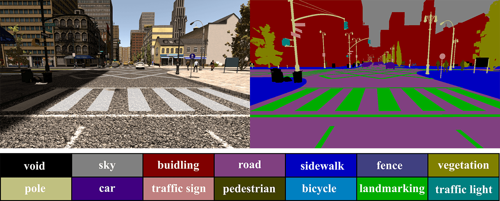
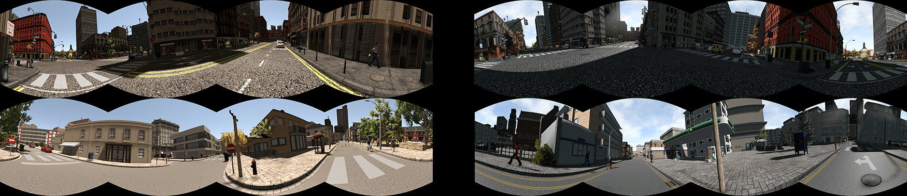

# SYNTHIA-PANO

## Description

SYNTHIA-PANO is the panoramic version of SYNTHIA dataset. Five sequences are included: Seqs02-summer, Seqs02-fall, Seqs04-summer, Seqs04-fall and Seqs05-summer.
Panomaramic images with fine annotation for semantic segmentation.

Video:

## Paper

[SYNTHIA](https://ieeexplore.ieee.org/document/7780721)

[SYNTHIA-PANO](https://arxiv.org/abs/1909.00532)

## Download

[BaiduDisk Link](https://pan.baidu.com/s/13f9Xuz8lHUehrPtmvAq3Dw?pwd=af69) code:af69 
